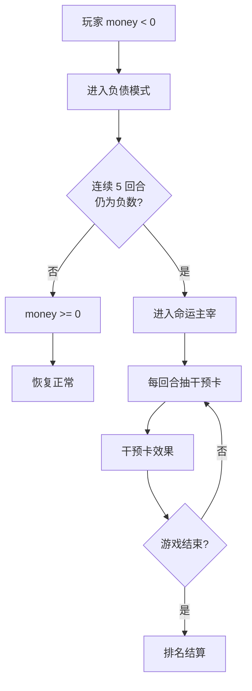

# 大富翁独立项目实施计划

> 本文件是项目的唯一事实来源（Single Source of Truth）。所有开发、扩展、改动必须基于此计划，修改前必须先更新此计划。

## 项目定位

- **独立仓库**：独立于 party-game monorepo，自建 `pnpm workspace`（shared / server / client）
- **入口**：当前项目首页提供一个「🎲 进入大富翁」卡片链接（后续处理，第一阶段搁置）
- **并发**：2-12 人/局，无 50 人并发需求
- **渲染**：Pixi.js 8（WebGL 2.5D isometric） + Vue 3（UI 组件）
- **通信**：REST API（操作）+ WebSocket（推送）
- **持久化**：SQLite（单局游戏时长 30-60 分钟，需要存档恢复）
- **破产玩家体验**：负债模式 → 命运主宰（详见后文）

---

## 一、仓库结构

```
monopoly/
├── package.json                  # 根 workspace
├── pnpm-workspace.yaml           # packages: ['shared', 'server', 'client']
├── tsconfig.base.json
├── .eslintrc.js
├── docker-compose.yml
│
├── shared/
│   ├── package.json              # @monopoly/shared
│   └── src/
│       ├── index.ts
│       ├── types.ts              # 所有共享类型定义
│       └── constants.ts          # 棋盘配置、价格表、卡牌常量
│
├── server/
│   ├── package.json              # @monopoly/server
│   ├── Dockerfile
│   └── src/
│       ├── index.ts              # Express + ws 启动
│       ├── config.ts
│       ├── rooms.ts              # 简化版房间管理（~200 行）
│       ├── game/
│       │   ├── GameEngine.ts     # 核心状态机
│       │   ├── board.ts          # 标准 40 格棋盘数据
│       │   ├── cards.ts          # 32 张卡牌定义 + 效果执行
│       │   ├── auction.ts        # 拍卖逻辑
│       │   ├── trade.ts          # 交易逻辑
│       │   ├── building.ts       # 建造/拆除逻辑
│       │   ├── mortgage.ts       # 抵押/赎回逻辑
│       │   ├── jail.ts           # 监狱出入逻辑
│       │   ├── bankruptcy.ts     # 负债模式 + 命运主宰
│       │   └── ai.ts             # AI 托管策略
│       ├── routes/
│       │   └── game.ts           # REST API 路由
│       ├── ws/
│       │   └── handler.ts        # WebSocket 事件推送
│       └── db/
│           ├── schema.ts         # SQLite schema
│           └── queries.ts        # 查询封装
│
└── client/
    ├── package.json              # @monopoly/client
    ├── Dockerfile
    ├── nginx.conf
    └── src/
        ├── main.ts               # Vue 3 入口
        ├── App.vue
        ├── router/index.ts
        ├── engine/
        │   ├── PixiBoard.ts      # isometric 棋盘容器
        │   ├── TileRenderer.ts   # 格子渲染
        │   ├── PieceRenderer.ts  # 棋子动画
        │   └── DiceRenderer.ts   # 骰子动画
        ├── pages/
        │   ├── LobbyPage.vue     # 大厅：创建/加入房间
        │   ├── GamePage.vue      # 游戏主界面
        │   └── BoardEditor.vue   # 棋盘编辑器（Phase 7）
        ├── components/
        │   ├── PlayerPanel.vue   # 玩家资金/地产列表
        │   ├── ActionBar.vue     # 底部操作栏
        │   ├── TradeModal.vue    # 交易弹窗
        │   ├── AuctionPanel.vue  # 拍卖面板
        │   ├── CardPopup.vue     # 卡牌弹窗
        │   ├── JailPanel.vue     # 监狱选择面板
        │   ├── PropertyPanel.vue # 地产管理面板
        │   └── EventLog.vue      # 事件日志
        ├── stores/
        │   ├── monopolyGame.ts   # 游戏状态（Pinia）
        │   └── monopolyRoom.ts   # 房间状态
        └── composables/
            └── useMonopolySocket.ts
```

---

## 二、数据模型

### 2.1 核心类型（`shared/src/types.ts`）

```typescript
// ===== 棋盘 =====
type CellType =
  | 'go' | 'property' | 'chance' | 'chest' | 'tax'
  | 'jail' | 'jail_visit' | 'free_parking'
  | 'railroad' | 'utility'

type PropertyGroup =
  | 'brown' | 'light_blue' | 'pink' | 'orange'
  | 'red' | 'yellow' | 'green' | 'dark_blue'

interface BoardCell {
  index: number
  type: CellType
  name: string
  group?: PropertyGroup
  price?: number
  rent: number[]         // [空地, 1房, 2房, 3房, 4房, 酒店]
  houseCost?: number
  mortgageValue?: number
}

// ===== 玩家 =====
interface MonopolyPlayer {
  id: string
  nickname: string
  money: number
  position: number
  inJail: boolean
  jailTurns: number
  getOutOfJailCards: number
  bankrupt: boolean
  turnsSinceDebt: number        // 负债模式持续回合数
  debtMode: boolean
  fateMaster: boolean           // 是否处于命运主宰模式
  consecutiveDoubles: number
  isAI: boolean
  isConnected: boolean
}

// ===== 地产状态 =====
interface PropertyState {
  cellIndex: number
  ownerId: string | null
  houses: number         // 0-5, 5=酒店
  mortgaged: boolean
}

// ===== 拍卖 =====
interface AuctionState {
  propertyIndex: number
  highestBidder: string | null
  highestBid: number
  bidders: string[]
  passedBidders: string[]
  timerEnd: number
}

// ===== 交易 =====
interface TradeOffer {
  id: string
  fromId: string
  toId: string
  offer: TradeAsset
  request: TradeAsset
  status: 'pending' | 'accepted' | 'rejected' | 'cancelled'
}

interface TradeAsset {
  money: number
  properties: number[]
  getOutOfJailCards: number
}

// ===== 卡牌 =====
interface MonopolyCard {
  id: string
  type: 'chance' | 'chest'
  text: string
  effect: CardEffect
}

interface CardEffect {
  action: 'gain_money' | 'lose_money' | 'gain_per_player'
      | 'pay_per_player' | 'move_to' | 'move_back' | 'go_to_jail'
      | 'get_out_of_jail' | 'repairs' | 'street_repairs'
      | 'advance_to_nearest' | 'go_to_start'
  amount?: number
  targetIndex?: number
  group?: PropertyGroup
}

// ===== 命运主宰干预卡 =====
interface FateCard {
  id: string
  name: string
  description: string
  effect: FateEffect
}

type FateEffect =
  | { type: 'double_rent'; targetId: string }
  | { type: 'move_back'; targetId: string; steps: number }
  | { type: 'lose_money'; targetId: string; amount: number }
  | { type: 'remove_house'; targetId: string }
  | { type: 'go_to_jail'; targetId: string }
  | { type: 'skip_turn'; targetId: string }

// ===== 游戏阶段 =====
type GamePhase =
  | 'waiting_for_roll'
  | 'rolled'
  | 'decision'           // 停在空地：买/拍卖
  | 'auction'
  | 'trade_offer'
  | 'building'
  | 'jail_decision'
  | 'card_animation'
  | 'debt_mode'
  | 'fate_master'
  | 'game_over'

// ===== 游戏状态 =====
interface MonopolyGameState {
  id: string
  board: BoardCell[]
  players: MonopolyPlayer[]
  properties: PropertyState[]
  currentPlayerIndex: number
  phase: GamePhase
  turn: number
  dice: [number, number]
  isDouble: boolean
  freeParkingPool: number
  chanceDeck: MonopolyCard[]
  chestDeck: MonopolyCard[]
  usedChanceCards: MonopolyCard[]
  usedChestCards: MonopolyCard[]
  auction: AuctionState | null
  pendingTrade: TradeOffer | null
  lastEvents: GameEvent[]
  startedAt: number
  turnTimeLimit: number    // 毫秒
  houseSupply: number      // 剩余房屋 32
  hotelSupply: number      // 剩余酒店 12
}
```

### 2.2 游戏事件（`shared/src/types.ts`）

```typescript
interface GameEvent {
  id: string
  turn: number
  timestamp: number
  type: GameEventType
  data: Record<string, unknown>
}

type GameEventType =
  | 'game_start'
  | 'turn_start'
  | 'dice_rolled'
  | 'player_moved'
  | 'passed_go'
  | 'property_bought'
  | 'rent_paid'
  | 'house_built'
  | 'house_sold'
  | 'property_mortgaged'
  | 'property_unmortgaged'
  | 'card_drawn'
  | 'card_effect'
  | 'tax_paid'
  | 'went_to_jail'
  | 'left_jail'
  | 'auction_started'
  | 'auction_bid'
  | 'auction_won'
  | 'trade_offered'
  | 'trade_completed'
  | 'entered_debt_mode'
  | 'became_fate_master'
  | 'fate_card_used'
  | 'player_bankrupt'
  | 'turn_end'
  | 'game_over'
```

---

## 三、标准棋盘定义（`server/src/game/board.ts`）

40 格标准大富翁布局：

```
索引  名称              类型          颜色  价格  租金(空地/1/2/3/4/酒店)
0     GO                go
1     地中海大道        property     brown  60   [2,10,30,90,160,250]
2     社区宝箱          chest
3     波罗的海大道      property     brown  60   [4,20,60,180,320,450]
4     所得税            tax                   200
5     国王十字车站      railroad
6     东方大道          property     light_blue 100  [6,30,90,270,400,550]
7     机会              chance
8     佛蒙特大道        property     light_blue 100  [6,30,90,270,400,550]
9     康涅狄格大道      property     light_blue 120  [8,40,100,300,450,600]
10    监狱/参观          jail
11    圣查尔斯广场       property     pink    140   [10,50,150,450,625,750]
12    电力公司          utility
13    州立大道           property     pink    140   [10,50,150,450,625,750]
14    维吉尼亚大道       property     pink    160   [12,60,180,500,700,900]
15    宾夕法尼亚铁路     railroad
16    圣詹姆斯广场       property     orange  180   [14,70,200,550,750,950]
17    社区宝箱          chest
18    田纳西大道         property     orange  180   [14,70,200,550,750,950]
19    纽约大道           property     orange  200   [16,80,220,600,800,1000]
20    免费停车          free_parking
21    肯塔基大道         property     red     220   [18,90,250,700,875,1050]
22    机会              chance
23    印第安纳大道       property     red     220   [18,90,250,700,875,1050]
24    伊利诺伊大道       property     red     240   [20,100,300,750,925,1100]
25    B&O 铁路           railroad
26    大西洋大道         property     yellow  260   [22,110,330,800,975,1150]
27    文特诺大道          property     yellow  260   [22,110,330,800,975,1150]
28    自来水公司         utility
29    马文花园           property     yellow  280   [24,120,360,850,1025,1200]
30    进监狱            go_to_jail
31    太平洋大道         property     green   300   [26,130,390,900,1100,1275]
32    北卡大道           property     green   300   [26,130,390,900,1100,1275]
33    社区宝箱          chest
34    宾夕法尼亚大道     property     green   320   [28,150,450,1000,1200,1400]
35    短途铁路          railroad
36    机会              chance
37    公园广场           property     dark_blue 350 [35,175,500,1100,1300,1500]
38    奢侈税            tax                   100
39    董事会大道         property     dark_blue 400 [50,200,600,1400,1700,2000]
```

---

## 四、REST API 设计

所有接口前缀 `/api/games`，请求/响应全是 JSON。

### 4.1 房间/游戏生命周期

| 方法 | 路径 | 请求体 | 响应 | 说明 |
|------|------|--------|------|------|
| POST | `/api/games` | `{ name, maxPlayers?, password? }` | `{ gameId, code }` | 创建游戏 |
| POST | `/api/games/:id/join` | `{ nickname, password? }` | `{ playerId, players }` | 加入游戏 |
| POST | `/api/games/:id/start` | — | `{ state }` | 开始游戏（房主） |
| GET  | `/api/games` | — | `{ games: [...] }` | 房间列表 |
| GET  | `/api/games/:id` | — | `{ state }` | 游戏快照 |
| GET  | `/api/games/:id/events?since=<seq>` | — | `{ events }` | 增量事件 |
| POST | `/api/games/:id/leave` | — | — | 离开游戏 |

### 4.2 玩家操作

| 方法 | 路径 | 说明 |
|------|------|------|
| POST | `/api/games/:id/roll` | 掷骰子 |
| POST | `/api/games/:id/buy` | 购买当前地产 |
| POST | `/api/games/:id/declare_bankruptcy` | 宣布破产 |
| POST | `/api/games/:id/next_turn` | 确认动画结束，进入下一回合 |
| POST | `/api/games/:id/skip_turn` | 跳过回合（命运主宰用） |

### 4.3 拍卖

| 方法 | 路径 | 请求体 | 说明 |
|------|------|--------|------|
| POST | `/api/games/:id/auction/bid` | `{ amount }` | 出价（需高于当前最高） |
| POST | `/api/games/:id/auction/pass` | — | 放弃出价 |

### 4.4 交易

| 方法 | 路径 | 请求体 | 说明 |
|------|------|--------|------|
| POST | `/api/games/:id/trade/offer` | `{ toId, offer, request }` | 发起交易 |
| POST | `/api/games/:id/trade/respond` | `{ tradeId, accept }` | 接受/拒绝 |
| POST | `/api/games/:id/trade/cancel` | `{ tradeId }` | 取消交易 |

### 4.5 地产管理

| 方法 | 路径 | 请求体 | 说明 |
|------|------|--------|------|
| POST | `/api/games/:id/build` | `{ cellIndex }` | 建造一栋房屋 |
| POST | `/api/games/:id/sell` | `{ cellIndex }` | 出售一栋房屋 |
| POST | `/api/games/:id/mortgage` | `{ cellIndex }` | 抵押 |
| POST | `/api/games/:id/unmortgage` | `{ cellIndex }` | 赎回 |

### 4.6 监狱

| 方法 | 路径 | 请求体 | 说明 |
|------|------|--------|------|
| POST | `/api/games/:id/jail/fee` | — | 交 $50 保释金出狱 |
| POST | `/api/games/:id/jail/roll` | — | 掷骰出狱（double 即出） |
| POST | `/api/games/:id/jail/card` | — | 用免狱卡出狱 |

### 4.7 命运主宰

| 方法 | 路径 | 请求体 | 说明 |
|------|------|--------|------|
| POST | `/api/games/:id/fate/use_card` | `{ targetId, fateCardId }` | 使用干预卡 |
| POST | `/api/games/:id/fate/predict` | `{ prediction }` | 预测骰子和 |

### 4.8 聊天

| 方法 | 路径 | 请求体 | 说明 |
|------|------|--------|------|
| POST | `/api/games/:id/chat` | `{ text }` | 发送聊天消息 |

---

## 五、WebSocket 事件

连接路径：`ws://host/ws?gameId=xxx&playerId=xxx`

### 5.1 Server → Client 推送

| 事件名 | 数据 | 说明 |
|--------|------|------|
| `game_started` | `{ state }` | 游戏开始，推送全量状态 |
| `turn_changed` | `{ playerId, turn, phase }` | 轮到了哪位玩家 |
| `dice_rolled` | `{ dice1, dice2, isDouble }` | 骰子结果 |
| `piece_moved` | `{ playerId, from, to, path[] }` | 棋子移动路径 |
| `passed_go` | `{ playerId, bonus }` | 经过起点领钱 |
| `landed` | `{ playerId, cellIndex, cellType }` | 停在某格 |
| `property_bought` | `{ playerId, cellIndex, price }` | 地产被购买 |
| `rent_paid` | `{ fromId, toId, amount }` | 付租 |
| `house_built` | `{ playerId, cellIndex, houses }` | 房屋建造 |
| `house_sold` | `{ playerId, cellIndex, houses }` | 房屋出售 |
| `property_mortgaged` | `{ playerId, cellIndex }` | 抵押 |
| `property_unmortgaged` | `{ playerId, cellIndex }` | 赎回 |
| `card_drawn` | `{ playerId, card }` | 抽卡 |
| `tax_paid` | `{ playerId, amount, reason }` | 缴税 |
| `went_to_jail` | `{ playerId }` | 进监狱 |
| `left_jail` | `{ playerId, method }` | 出监狱 |
| `auction_started` | `{ cellIndex, startBid }` | 拍卖开始 |
| `auction_bid` | `{ playerId, amount }` | 有人出价 |
| `auction_ended` | `{ winnerId, amount }` | 拍卖结束 |
| `trade_offered` | `{ trade }` | 有人发起交易 |
| `trade_completed` | `{ trade }` | 交易完成 |
| `entered_debt_mode` | `{ playerId }` | 进入负债模式 |
| `became_fate_master` | `{ playerId }` | 成为命运主宰 |
| `fate_card_used` | `{ fromId, targetId, effect }` | 使用干预卡 |
| `player_bankrupt` | `{ playerId }` | 玩家破产 |
| `state_sync` | `{ state }` | 全量状态同步（断线重连用） |
| `chat_message` | `{ playerId, nickname, text }` | 聊天消息 |
| `game_over` | `{ winner, scores, stats }` | 游戏结束 |
| `error` | `{ code, message }` | 错误提示 |

### 5.2 推送策略

- 所有 REST 操作成功后，server 通过 ws 广播事件给房间内所有玩家
- 动画类事件（`dice_rolled`, `piece_moved`, `card_drawn`）包含动画参数，client 播完动画后调用 `POST /next_turn` 确认
- `state_sync` 在断线重连时全量推送

---

## 六、游戏规则规范

### 6.1 起始设置

- 每位玩家起始资金：**$1500**
- 掷骰子决定顺序（点数相同再掷）
- 双方各掷一次，点数最大者先走
- 棋子放在起点（索引 0）

### 6.2 回合流程

```
1. 掷骰子（两个骰子 1-6）
   ├── 连续三次 double → 进监狱（不移动），回合结束
   └── double → 掷完后可以再掷（移动 + 触发格子在前面）
2. 移动棋子
   ├── 经过起点 → +$200
   └── 停在格子 → 触发格子效果
3. 触发格子效果
4. 如果掷出 double → 返回步骤 1
   否则 → 调用 /next_turn 结束回合
```

### 6.3 格子触发逻辑

```
property（空地）:
  └── phase = 'decision'
      ├── POST /buy → 购买（价格 = BoardCell.price）
      └── POST /auction/pass → 触发拍卖

property（别人拥有、未抵押）:
  ├── 普通地产：付租金（按房屋数量）
  ├── 铁路：$25 × 持有者铁路数量（1=$25, 2=$50, 3=$100, 4=$200）
  └── 公用事业：4×骰子和（1个）/ 10×骰子和（2个）

property（自己拥有 / 他人抵押中）:
  └── 无事发生

chance / chest:
  └── 从对应牌堆顶部抽一张，执行效果，放回牌堆底部

tax:
  ├── 所得税：$200 或 10%总资产（玩家选）
  └── 奢侈税：$100

go:
  └── 无事（经过时已领钱）

jail_visit:
  └── 无事（只是路过）

go_to_jail:
  └── 直接进监狱，不经过起点

free_parking:
  └── 获得 freeParkingPool 中累积的资金
```

### 6.4 建造规则

- **条件**：持有同色组全部地产、该组全部未抵押、房屋供应 > 0
- **建造费**：`BoardCell.houseCost`
- **均衡建造**：同一色组内，房屋数量差不能超过 1（例：色组 3 块地，可以 2/2/1，不能 3/1/0）
- **酒店**：每块地 4 栋房屋后，再花 houseCost 升级为酒店（同时消耗 4 栋房屋）
- **供应限制**：全游戏 32 栋房屋、12 栋酒店
- **出售**：酒店 → 4 栋房屋（+ houseCost），房屋 → 银行（半价回收）

### 6.5 抵押规则

- **抵押价值**：`price / 2`（向下取整）
- **赎回费用**：`mortgageValue * 1.1`（10% 利息）
- **抵押中**：不收租、不可建造、不可交易
- **条件**：该地产上无房屋（有的话要先卖光）

### 6.6 拍卖规则

- **触发条件**：玩家拒绝购买空地 或 买不起
- **流程**：
  1. 从当前玩家开始轮流出价
  2. 最低出价 = $10（不可低于起拍价）
  3. 出价递增 ≥ $10
  4. 选择 "放弃" 即退出拍卖
  5. 最后剩 1 人时得标，付款
  6. 无人出价则流拍（地产归银行）

### 6.7 交易规则

- **可交易**：地产（无房屋）、金钱、免狱卡
- **不可交易**：有房屋的地产、抵押中的地产
- **一方提出 → 对方确认/拒绝 → 完成**
- **交易中不得有对方参与拍卖（互斥）**

### 6.8 监狱规则

- **进监狱方式**：
  - 停在 "进监狱" 格（索引 30）
  - 连续三次 double
  - 抽到 "进监狱" 卡
- **出狱方式**（三选一）：
  - 交 $50 保释金（回合开始时，掷骰前）
  - 用免狱卡（回合开始时）
  - 掷骰出狱（double 即出，不能再掷）
- **监狱内**：
  - 可以收租
  - 不能买地、建造
  - 三次重试掷骰仍没出狱 → 强制交 $50 出狱
  - 经过监狱格不算停

### 6.9 收租顺序

```
触发格子 = 某玩家地产
  1. 检查是否已抵押 → 抵押中不收租
  2. 检查是否有房屋 → 有房屋按 rent[houses]
  3. 无房屋 → 检查同色组是否全占
     ├── 全占 → 2× rent[0]（双倍空地租）
     └── 未全占 → rent[0]
```

### 6.10 破产负债与命运主宰



**负债模式规则**：
- 继续掷骰移动，经过起点领钱（自动还债）
- 收租的钱：50% 还债，50% 可用
- 可抵押地产换钱还债
- 可折价（半价）出售房屋给银行
- 不能买地、建造、拍卖出价
- 触发门槛：`money + 所有地产抵押价值 + 所有房屋半价 < 0`

**命运主宰规则**：
- 跳过本回合（不掷骰、不移动、不触发）
- 从干预卡堆随机抽一张，选择目标玩家执行
- 干预卡种类（每次随机抽 2 张选 1 张使用）：

| 干预卡 | 效果 |
|--------|------|
| ⚡ 租金加倍 | 目标玩家下一轮租金收入翻倍（欠债人不获益） |
| 🫸 后退三步 | 目标后退 3 格，后退不领钱、不触发 |
| 💸 罚款 | 目标损失 $300 |
| 🏚️ 强拆 | 目标最贵的地产上拆一栋房 |
| 🚔 逮捕 | 目标直接进监狱 |
| 🔄 互换位置 | 与目标玩家交换位置 |
| 📉 减收 | 目标下一轮收租减半 |
| 💰 慈善 | 目标获得 $200（从银行出） |

**双人决赛圈规则**：
- 剩余 2 名正常玩家时，命运主宰选择站队
- 选对边：最终 +50 荣誉分（不影响胜负，仅用于结算称号）
- 称号：`大富翁`（第 1）、`地产大亨`（第 2）、`操盘手`（第 3）...

### 6.11 AI 托管策略

**触发条件**：玩家断线 > 60s 或主动点击 "托管"

```
优先级队列（每回合执行）:
  1. 如果 money < 0 → 抵押最便宜的地产还债
  2. 如果仍有房屋 → 出售降级（从最贵的地开始）
  3. 掷骰子、移动
  4. 空地 → 如果 money > price + 200 → 买
  5. 如果可建造 → 优先造最贵的色组
  6. 拍卖 → 出价不超过 money 的 30%
  7. 交易 → 不主动发起交易（不退不换）
```

### 6.12 胜利条件

- **标准胜利**：最后一名未破产玩家获胜
- **限时模式**（可选）：设定 N 回合（如 50 回合），回合数到达后按总资产排名
- **排名规则**：总资产 = 现金 + 地产估值（买入价） + 房屋价值（半价）+ 抵押地产（抵押价）

---

## 七、客户端 Pixi.js 渲染规范

### 7.1 棋盘布局

```
屏幕坐标计算（isometric 投影）:
  2D 网格坐标 (gridX, gridY)  →  屏幕坐标 (screenX, screenY)
  screenX = (gridX - gridY) * tileWidth / 2
  screenY = (gridX + gridY) * tileHeight / 2

40 格环绕路径:
  顶部行: 索引 0 → 10（从左到右）
  右侧列: 索引 10 → 20（从上到下）
  底部行: 索引 20 → 30（从右到左）
  左侧列: 索引 30 → 40/0（从下到上）
```

### 7.2 格子渲染规范

```
每个格子:
├── 背景（圆形/矩形 + 颜色组底色）
│   ├── 普通地产: 顶部颜色条（组色）
│   ├── 铁路: 深灰色
│   ├── 公用事业: 浅蓝色
│   ├── 卡牌格: 橙色/紫色
│   └── 特殊格: 自定义图标
├── 名称文字
├── 房屋标记（绿色小方块 1-4，酒店红色）
├── 所有权标记（棋子颜色小旗）
├── 抵押标记（翻转/灰色遮罩）
├── 选中高亮（当前玩家位置发光）
└── 悬停提示（tooltip）
```

### 7.3 棋子动画

```
棋子移动:
├── Tween 沿路径平滑移动（duration: 300ms/格）
├── 路径 = 经过的所有格子索引
└── 经过起点时闪烁效果
```

### 7.4 骰子动画

```
CSS 3D 六面骰:
├── 两个骰子并排
├── 旋转动画 600ms
├── 最终停到结果面
└── 低端设备降级为 2D 数字跳跃
```

## 九、移动端适配方案

### 9.1 布局策略

桌面端（>1024px）：三栏布局

```
┌───────┬──────────────┬───────┐
│ 左侧栏│              │ 右侧栏 │
│Player │   棋盘       │ Event │
│Panel  │ BoardContainer│  Log  │
│(240px)│   填满剩余宽度  │(220px)│
└───┬───┴──────┬───────┴───┬───┘
    │         ActionBar    │
    └─────────────────────┘
```

手机端（<768px）：单列布局

```
┌─────────────────────┐
│ Header (紧凑)        │ ← 拐角按钮弹出玩家面板
├─────────────────────┤
│                     │
│    棋盘 (宽度填满)    │
│    padding 减半      │
│                     │
├─────────────────────┤
│  ActionBar (换行)    │ ← 按钮缩小、换行
├─────────────────────┤
│ 📋 事件 (折叠/展开)   │ ← 默认折叠，点开展开
└─────────────────────┘
```

平板（768-1024px）：双栏布局

```
┌──────────┬───────────┐
│ 左侧栏    │  棋盘      │
│ (折叠)    │  填满剩余   │
└──────────┴───────────┘
│ ActionBar           │
│ 事件 (底部条)         │
└─────────────────────┘
```

### 9.2 手机端具体处理

| 组件 | 桌面 | 手机 |
|------|------|------|
| `sidebar-left` (PlayerPanel) | 240px 固定 | `display: none`，通过顶部 🏆 按钮弹出 modal |
| `sidebar-right` (EventLog) | 220px 固定 | `display: none`，改为页面底部可折叠条 |
| `BoardContainer` | 填满 | 宽度 100%，`padding: 0.5rem`，最大宽度不变 |
| `ActionBar` | 单行 | 按钮缩小、间隙缩小、必要时换行 |
| `DiceRoller` | 40px | 缩小为 32px，`perspective` 相应缩小 |
| `Header` | 正常 | `padding` 减半，字号缩小 |
| 交易按钮 `btn-trade` | 侧栏内 | 放到 ActionBar 旁 |
| `PlayerPanel` modal | 不存在 | `position: fixed` 底部弹出，毛玻璃背景 |

### 9.3 CSS 媒体查询断点

遵循 party-game 主项目的常量：

```css
/* 手机 */
@media (max-width: 767px) { ... }

/* 平板 */  
@media (min-width: 768px) and (max-width: 1023px) { ... }

/* 桌面 */
@media (min-width: 1024px) { ... }
```

### 9.4 手机端 PlayerPanel Drawer

使用 Vue Transition 实现底部弹出面板：

```html
<Transition name="slide-up">
  <div v-if="showMobilePlayers" class="player-drawer-overlay" @click.self="showMobilePlayers = false">
    <div class="player-drawer">
      <div class="drawer-handle" />
      <PlayerPanel ... />
    </div>
  </div>
</Transition>
```

```css
.player-drawer-overlay {
  position: fixed; inset: 0;
  background: rgba(0,0,0,0.5);
  z-index: 50;
  display: flex;
  align-items: flex-end;
}
.player-drawer {
  width: 100%;
  max-height: 50vh;
  background: var(--bg);
  border-radius: 16px 16px 0 0;
  padding: 1rem;
}
```

### 9.5 手机端 EventLog 折叠条

```html
<div class="mobile-event-bar" @click="showEvents = !showEvents">
  <span>📋 {{ showEvents ? '收起' : '最新事件' }}</span>
  <span v-if="!showEvents">{{ latestEvent }}</span>
</div>
<Transition name="expand">
  <div v-if="showEvents" class="mobile-event-body">
    <EventLog :events="store.events" />
  </div>
</Transition>
```

### 9.6 涉及的文件

| 文件 | 改动内容 |
|------|---------|
| `GamePage.vue` | 添加媒体查询、手机状态变量 (`showMobilePlayers`, `showEvents`)、手机 PlayerPanel drawer 模板 |
| `BoardContainer.vue` | 手机端 padding 减半，`board-wrap` 背景色适配 |
| `ActionBar.vue` | 手机端按钮缩小、flex-wrap |
| `PlayerPanel.vue` | 无需改动（复用在 drawer 中） |
| `EventLog.vue` | 无需改动（复用在展开条中） |

**不改逻辑、不改数据流，纯样式 + 模板适配。**

---

## 八、实施阶段与里程碑

### Phase 1：项目骨架（3-4 天）

**目标**：创建项目，定义全部类型，渲染出静态棋盘

| 步骤 | 文件 | 交付物 |
|------|------|--------|
| 1.1 | 项目初始化 | 仓库创建、pnpm workspace、tsconfig、eslint、Dockerfile |
| 1.2 | `shared/src/types.ts` | 全部类型定义 |
| 1.3 | `shared/src/constants.ts` | 棋盘格数据、价格表、租金表 |
| 1.4 | `server/src/game/board.ts` | 标准 40 格棋盘 JSON |
| 1.5 | `server/src/index.ts` | Express + ws 启动，健康检查 |
| 1.6 | `server/src/rooms.ts` | 简化房间 CRUD |
| 1.7 | `client/src/main.ts` | Vue 3 入口 + 路由 |
| 1.8 | `client/src/engine/PixiBoard.ts` | Pixi.js 初始化 + 40 格占位渲染 |
| 1.9 | `client/src/pages/GamePage.vue` | 棋盘容器 + 无交互展示 |

**验证**：启动后浏览器看到空棋盘（40 个格子有颜色/文字）

### Phase 2：核心循环（7-10 天）

**目标**：完整的掷骰→移动→购买→拍卖→付租→下一回合

| 步骤 | 文件 | 交付物 |
|------|------|--------|
| 2.1 | `server/src/game/GameEngine.ts` | 状态机初始化、回合轮转、骰子逻辑 |
| 2.2 | `server/src/routes/game.ts` | roll / buy / next_turn 路由 |
| 2.3 | `server/src/ws/handler.ts` | ws 连接、游戏事件广播 |
| 2.4 | GameEngine.handleRoll() | 移动 + 经过起点 + 触发格子 |
| 2.5 | GameEngine.handleBuy() | 购买地产 |
| 2.6 | `server/src/game/auction.ts` | 拍卖循环 |
| 2.7 | GameEngine.handleAuctionBid() | 出价/放弃/得标 |
| 2.8 | rent 计算 | 普通地产 + 铁路 + 公用事业租金 |
| 2.9 | `client/src/stores/monopolyGame.ts` | 连接到 ws，接收事件 |
| 2.10 | `client/src/engine/PieceRenderer.ts` | 棋子移动动画 |
| 2.11 | `client/src/components/DiceRoller.vue` | 骰子动画 |
| 2.12 | `client/src/components/ActionBar.vue` | 掷骰、购买、拍卖按钮 |

**验证**：开浏览器，创建房间→加入→开始→掷骰→移动动画→买地→下一回合

### Phase 3：进阶模块（8-12 天，可并行）

| 模块 | 步骤 | 文件 | 天数 |
|------|------|------|------|
| 建造 | 3.1 | `building.ts` + `PropertyPanel.vue` | 2 |
| 抵押 | 3.2 | `mortgage.ts` + 按钮联动 | 1.5 |
| 交易 | 3.3 | `trade.ts` + `TradeModal.vue` | 3 |
| 监狱 | 3.4 | `jail.ts` + `JailPanel.vue` | 1.5 |
| 卡牌 | 3.5 | `cards.ts` + `CardPopup.vue` | 2 |
| 税务 | 3.6 | 所得税 + 奢侈税 + free parking 池 | 1 |

**验证**：可以和 AI 玩家跑完一局完整流程

### Phase 4：破产体验（4-5 天）

| 步骤 | 文件 | 交付物 |
|------|------|--------|
| 4.1 | `bankruptcy.ts` | 负债模式状态机 |
| 4.2 | 负债模式 UI | `PlayerPanel.vue` 显示负债状态 |
| 4.3 | 命运主宰逻辑 | fate card 定义 + 抽取 + 执行 |
| 4.4 | 命运主宰 UI | 干预卡选择弹窗 + 预测骰子输入 |
| 4.5 | `ai.ts` | AI 托管逻辑 |
| 4.6 | AI 触发 | 断线超时 → AI 接管，UI 标记 |
| 4.7 | 最终结算 | 排名 + 称号 + 统计 |

**验证**：加速测试（手动调低起始资金），看破产→负债→主宰→结束全流程

### Phase 5：完整 UI（3-5 天）

| 步骤 | 文件 | 交付物 |
|------|------|--------|
| 5.1 | `GamePage.vue` | 最终布局（棋盘+面板+操作栏+事件日志） |
| 5.2 | `PlayerPanel.vue` | 完整资金/地产列表/抵押标记 |
| 5.3 | `EventLog.vue` | 滚动事件日志 |
| 5.4 | 动画完善 | 购买、建造、收租过场动画 |
| 5.5 | 音效 | 掷骰、收钱、卡牌等音效（可选） |

### Phase 6：持久化（2-3 天）

| 步骤 | 文件 | 交付物 |
|------|------|--------|
| 6.1 | `db/schema.ts` | SQLite 建表 |
| 6.2 | `db/queries.ts` | 保存/加载游戏状态 |
| 6.3 | 自动保存 | 每次操作后异步保存 |
| 6.4 | 断线重连 | 恢复游戏状态 + ws 重连 |

### Phase 7：棋盘编辑器（后续）

不在此计划详述，核心玩法完成后启动。

---

## 九、数据流

```
客户端 ──────────────────────────────────── 服务端
      │                                          │
      │  1. POST /roll                            │
      │  ──────────────────────────────────────>  │
      │                                          │  GameEngine.handleRoll()
      │                                          │  ├── dice = [3, 5]
      │                                          │  ├── newPos = (oldPos + 8) % 40
      │                                          │  ├── events.push({ ... })
      │                                          │  └── phase = 'decision'
      │                                          │
      │  ws: dice_rolled { dice1:3, dice2:5 }    │
      │  <──────────────────────────────────────  │
      │  ws: piece_moved { path: [12,13,...,20] } │
      │  <──────────────────────────────────────  │
      │  ws: landed { cellIndex:20, type:'free_parking' } │
      │  <──────────────────────────────────────  │
      │                                          │
      │  [客户端播放骰子动画 600ms]                  │
      │  [客户端播放棋子移动动画 300ms×8=2400ms]     │
      │                                          │
      │  2. POST /next_turn                      │
      │  ──────────────────────────────────────>  │
      │                                          │  nextPlayer()
      │  ws: turn_changed { playerId: 'xxx' }    │
      │  <──────────────────────────────────────  │
```

---

## 十、技术选型理由

| 选型 | 替代方案 | 理由 |
|------|---------|------|
| **Pixi.js 8** | Three.js | Three.js 太重，2.5D 等距不需要 Z 轴旋转/光照，Pixi 的 Sprite 批处理更高效 |
| **Vue 3** | React | 团队已有 Vue 经验，复用 Pinia 模式 |
| **Express** | Fastify/Koa | 生态最成熟，团队已用 |
| **better-sqlite3** | PostgreSQL | 同步 API 无回调地狱、零配置、单文件部署 |
| **ws** | Socket.io | 大富翁不需要自动重连/房间命名空间等 Socket.io 特性，原生 ws 更轻量 |

---

## 十一、开发规范

- 所有新增功能必须先更新此计划
- Server 端每个 `handleXxx()` 方法必须有单元测试
- Client 端 Pixi 渲染与 Vue 状态完全解耦（Pixi 只负责画，不持有业务状态）
- 所有 API 请求必须有参数校验 + 错误码
- SQL 语句统一在 `db/queries.ts` 中，不散落在路由中
- 事件风暴期间的操作全部排队（mutex），防止竞态

---

> 本计划最后更新：2026-05-25
> 下次更新条件：开始新 Phase 前 / 发现计划与实现偏差时 / 新增需求时
